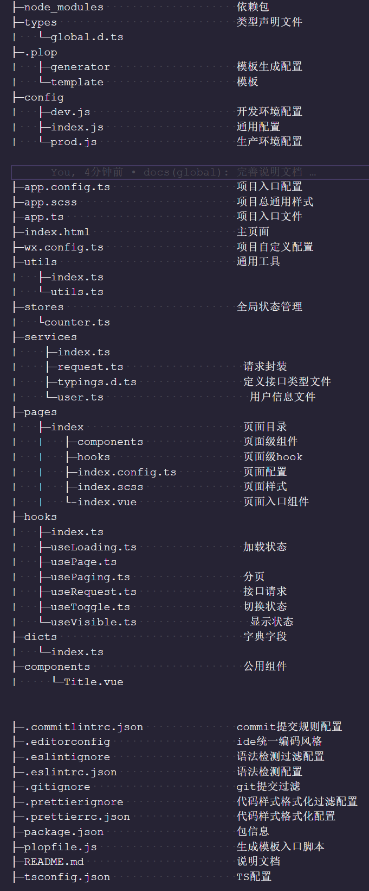

# 福利小程序

> 福利小程序是主要以活动推广为主的商品销售的小程序平台，该项目主要采用了vue3.0、Typescript、Pinia、Taro、Nut-UI等技术栈开发项目。


### 快捷入口

- [Vue 3.0](https://cn.vuejs.org/guide/introduction.html)
- [Taro内置组件库](https://taro-docs.jd.com/docs/components-desc)
- [Nut-UI组件库](https://nutui.jd.com/#/zh-CN/component/button)
- [常见GIt命令大全](./docs/git.md)
- [常见Hook语法](./docs/hook.md)


### 目录


- [技术栈](#技术栈)
- [项目结构](#项目结构)
- [npm脚本](#npm脚本)
- [IDE插件](#IDE插件)
- [规范标准](#规范标准)
- [风格规范](#风格规范)
- [环境变量](#环境变量)
- [代码调试](#代码调试)
- [别名引用](#别名引用)
- [开发人员](#开发人员)


### 技术栈

目前该项目采用以下技术栈：

- [微信小程序官方开发文档](https://developers.weixin.qq.com/miniprogram/dev/framework/)
- [Taro](https://taro-docs.jd.com/docs/) 是一个开放式跨端跨框架解决方案，支持使用 React/Vue/Nerv 等框架来开发 微信 / 京东 / 百度 / 支付宝 / 字节跳动 / QQ / 飞书 小程序 / H5 / RN 等应用。
- [Vue3](https://cn.vuejs.org/) Vue 3.0 是渐进式JavaScript 框架，易学易用，性能出色，适用场景丰富的 Web 前端框架。
- [TypeScript](https://www.tslang.cn/) 是一种基于 JavaScript 构建的强类型编程语言，可为您提供任何规模的更好工具。
- [SCSS](https://www.sass.hk/) 是一款强化 CSS 的辅助工具。
- [Nut-UI](https://nutui.jd.com/#/) 是京东风格的轻量级移动端 Vue 组件库。
- [Pinia](https://pinia.vuejs.org/) 是拥有组合式 API 的 Vue 状态管理库。
- [Git](https://git-scm.com/) 是一个免费的开源分布式版本控制系统，旨在快速高效地处理从小型项目到大型项目的所有内容。


### 项目结构




### npm 脚本

安装依赖

```shell
# 使用 npm
npm install

# OR 使用 yarn
yarn
```

开发环境运行

```shell
# 使用 npm
npm run dev:weapp

# OR 使用 yarn
yarn dev:weapp
```

生产环境运行

```shell
npm run prd:weapp
```

开发环境打包

```shell
npm run build:dev:weapp
```

生产环境打包

```shell
npm run build:prd:weapp
```

代码检测

```shell
npm run lint:eslint
```

代码检查（仅限检查已改动的文件）

```shell
npm run lint:lint-staged
```

修复代码

```shell
npm run fix:eslint
```

格式化代码

```shell
npm run fix:prettier
```

安装 git hook 管理

```shell
npm run prepare
```

commit 提交（包含规范描述）

```shell
npm run commit
```

生成模版

```shell
npm run plop
```

升级依赖

```shell
npm run deps
```


### IDE插件

采用vs code开发，需安装以下插件，方便项目开发，其作用编码、风格、自动填充、语法高亮等辅助功能。

- [EditorConfig for VS Code](https://marketplace.visualstudio.com/items?itemName=EditorConfig.EditorConfig)

- [ESLint](https://marketplace.visualstudio.com/items?itemName=dbaeumer.vscode-eslint)

- [JavaScript and TypeScript Nightly](https://marketplace.visualstudio.com/items?itemName=ms-vscode.vscode-typescript-next)

- [Prettier - Code formatter](https://marketplace.visualstudio.com/items?itemName=esbenp.prettier-vscode)

- [Vue Language Features (Volar)](https://marketplace.visualstudio.com/items?itemName=Vue.volar)

webstorm、以及其他ide后续更新。


### 规范标准

目前该项目采用以下规范标准：

- [vue 语法规范规则](https://vuejs.org/style-guide/rules-recommended.html)
- [Standard  js语法规范规则](https://standardjs.com/)
- [bem css样式命名规范](https://getbem.com/)


### 风格规范

- **注释**

  在所有组件（包含页面）中需要针对 `props` 和 `emits` 需要描述详细字段含义，并强制采用**多行注释**来描述。

  ```vue
  // FormCell.vue
  
  ...
  /**
   * @title 填写资料表单控件组件
   * @param icon 标题图标
   * @param iconColor 标题图标颜色
   * @param title 标题
   * @param value 表单内容
   * @param arrow 右箭头
   */
  withDefaults(
    defineProps<{
      icon: string;
      iconColor: string;
      title: string;
      value: string;
      arrow: boolean;
    }>(),
    {
      icon: undefined,
      iconColor: undefined,
      value: undefined,
      arrow: true,
    }
  );
        
  /**
   * @title 自定义事件
   * @param click 点击
   */
  const emits = defineEmits(['click']);
...
  ```

  
  
  在单独方法函数中，需要描述**参数**和**返回字段**，并强制采用**多行注释**来描述。
  
  ```vue
  // utils.ts
  
  ...
  /**
   * @title 暂停
   * @param {Number} timer 暂停时长（ms）
   * @param ...
   * @return {Promise.resolve} Promise 成功
   */
  export const delay = (timer: number = 1000) => {
    return new Promise((resolve) => {
      setTimeout(() => {
        resolve(Math.random());
      }, timer);
    });
  };
  ...
  ```
  
  
  
  在逻辑复杂的代码，可采用**单行注释**，不要采用**多行注释**，不然降低代码可读性，会破环代码结构性。
  
  ```vue
  //demo.vue
  
  // 是否工作时间
  checkWork(timeNum) {
    const startWork = this.workGroup[0];
    const endWork = this.workGroup[1];
    // 计算符合工作开始 与 工作结束 范围内
    return timeNum <= endWork && timeNum >= startWork;
  }
  ```
  
  **但也不要盲目注释，对易懂代码无需注释，反而会增加开发成本。**
  
  
  
- **定义类型**

  为了区分TS定义类型，在使用`interface`定义类型，需要加上 **I** 前缀，例如：IFormProps、ICheckboxProps

  ```typescript
  interface IFormProps {
  	...
  }
  
  // type定义不需添加前缀
  type FormProps {
  	...
  }
  ```

  **在services中的typings.d.ts中的定义请求响应结果的数据类型可以无需区分。**

  

  

  由于vue组件（pages、components）不能导出组件私有类型，为了解决这个问题，需要在当前组件路径下定义.d.ts文件。例如Menu组件

  - Menu.vue
  - Menu.d.ts


- **页面**

  页面必须包含（**index.config.ts**、**index.scss**、**index.vue**）文件。针对仅在页面中使用的hook、component需要单独创建文件夹（**hooks/***，**components/***）

  考虑业务会比较大，组件文件中的代码能会过于臃肿，所以**样式 scss 文件和组件文件需要单独创建**。

  页面结构：以个人用户为例

  - User
    - index.config.ts
    - index.scss
    - index.vue
    - hooks/*
    - components/*


- **组件**

  组件**命名必须统一大驼峰命名**风格

  - Title.vue
  - Menu.vue
  - MenuItem.vue


​		组件必须采用**`<script setup>`**编码方式


​		**尽量在顶部使用hook**，并且确保不会影响**hook定义变量顺序关系**

```vue
// index.vue （index组件）

<script setup lang="ts">
  import { useVisible, useToggle, useRequest, useLoadRefresh } from '@hooks/index';
  const { visible, showVisible } = useVisible();
  const { state, on, off } = useToggle();

  ...
</script>

...
```


- **服务接口**

  接口方法变量前缀命名说明

  - **Get**：查询、获取
  - **Add**：新增
  - **Update**：修改、状态更改
  - **Del**：删除
  - **Export**：导出
  - **Download**：下载


- **模块导入**

  **引入模块中，需要引入具体的index索引文件**，因为在TS中对别名处理后的路径不能够很好地支持，索引在引入模块需要引用到具体的index索引文件。

```vue
// index.vue （index组件）

<script setup lang="ts">
  import { GetProfile } from '@services/index';    // 正确
  import { useVisible } from '@hooks';             // 错误
</script>

...
```


- **全局配置**

  针对业务全局配置统一必须在**`wx.config.js`**文件编写。

```javascript
// app.config.js （全局配置）

import pkage from '../package.json';

export default {
  // 版本
  version: pkage.version,

  // 应用标题
  title: 'template',

  // host请求地址，可在package.json配置
  host: REQUEST_URL,

  // 请求时长（ms）
  timeout: 2000,
};

```


### 环境变量

在项目根目录中的`config`目录中包含**dev.js (开发环境)**、**prod.js (生产环境)**这两个文件中，在`defineConstants`字段可定义变量。**需要注意在定义变量需要`JSON.stringify`方法包裹使用**。案例见以下：

```javascript
// config/dev.js （开发环境）

module.exports = {
  env: {
    NODE_ENV: '"development"',
  },

  defineConstants: {
    REQUEST_URL: JSON.stringify('【生成环境】http://111.111.11.111:8080/'),
    PRODUCTION: JSON.stringify(true),
  },
  ...
};

```

可在代码直接使用

```javascript
// *.ts\vue

console.log(REQUEST_URL);
```

如有不清楚，也可访问官方提供的针对[环境变量](https://taro-docs.jd.com/docs/config-detail#env)的说明。


### 代码调试

在taro框架下开发vue 3.0项目时，已经支持vue devtools工具代码调试，但仍处于实验性阶段，可能存在一些的调试问题。

下载依赖包

```shell
yarn add --dev @tarojs/plugin-vue-devtools
```

配置taro插件

```javascript
// config/dev.js

config = {
  plugins: [
    '@tarojs/plugin-vue-devtools'
  ],
  // ...
}
```
重跑项目即可。


### 别名引用

通过别名引用配置可以简化很长的模块引用，也很好地解决vs code不能跳转相对应文件中，以减少开发者对路径问题的烦恼。

在项目根目录中的`config`目录中包含**index.js(通用环境)**这个文件中，在`alias`字段可定义路径别名。

```javascript
// config/index.js （通用环境）
const path = require('path');

module.exports = {
  ...
  alias: {
    '@': path.resolve(__dirname, '..', 'src'),
    '@components': path.resolve(__dirname, '..', 'src/components'),
    '@hooks': path.resolve(__dirname, '..', 'src/hooks'),
    '@services': path.resolve(__dirname, '..', 'src/services'),
    '@stores': path.resolve(__dirname, '..', 'src/stores'),
    '@utils': path.resolve(__dirname, '..', 'src/utils'),
    '@dicts': path.resolve(__dirname, '..', 'src/dicts')
  },
  ...
};

```

针对TS语法的项目中，同时**还需要配置TS别名，以更好地配置TS语法自动填充、语法检测、跳转等功能**，配置如下：

```json
// tsconfig.json （TS配置文件）

{
  ...
  "compilerOptions": {
    ...
    "paths": {
      "@/*": [
        "src/*"
      ],
      "@components/*": [
        "src/components/*"
      ],
      "@hooks/*": [
        "src/hooks/*"
      ],
      "@services/*": [
        "src/services/*"
      ],
      "@stores/*": [
        "src/stores/*"
      ],
      "@utils/*": [
        "src/utils/*"
      ],
      "@dicts/*": [
        "src/dicts/*"
      ]
    }
    ...
  }
  ...
}


```

该项目中，已配置`src`、`components`、`hooks`、`services`、`stores`、`utils`、`dicts`路径别名，已满足绝大部分的需求。

在代码使用

```vue
// index.vue （index组件）

...

<script setup lang="ts">
  import appConfig from '@/app.config';
  import { useVisible } from '@hooks/index';
  import { useCounterStore } from '@stores/counter';
  import { GetProfile } from '@services/index';
</script>

...
```

**注意在引入模块中，需要引入具体的文件，如`@hooks`，需改为`@hooks/index`，这样是为了语法规范，其次前者在ts别名中不能更好地识别。**在[风格规范](#风格规范)中也会相关说明。

如有不清楚，也可访问官方提供的针对[路径别名](https://taro-docs.jd.com/docs/config-detail#alias)的说明。


### 开发人员

[@wangjin](http://192.168.31.222/wangjin)

[@yangwenjun](http://192.168.31.222/yangwenjun)](http://192.168.31.222/wangjin)

[@huchao](http://192.168.31.222/huchao)

[@gxx](http://192.168.31.222/gxx)

