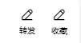
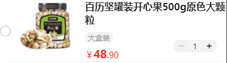
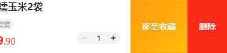
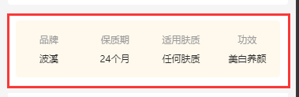
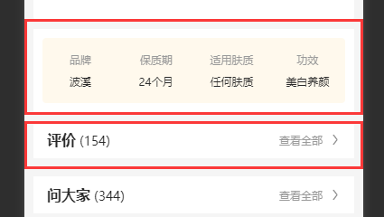
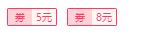
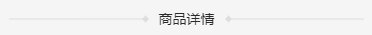

# 通用组件语法

## 附录

- [ActionBtn](#ActionBtn)：图标按钮组合组件
- [CarItem](#CarItem)：购物车单行组件
- [Container](#Container)：容器组件
- [CouponTag](#CouponTag)：优惠劵标签组件
- [Divider](#Divider)：分割线组件
- [InputNumber](#InputNumber)：数字输入框组件
- [SafeArea](#SafeArea)：安全区组件
- [Section](#Section)：块组件
- [SpecRadio](#SpecRadio)：规格单选框组件
- [SpecRadioGroup](#SpecRadioGroup)：规格单选框组合

## 案例

### ActionBtn：图标按钮组合组件

#### 截图



#### 案例

```vue
<ActionBtn
  :class="className('__goods-info-card__action')"
  icon="edit"
  title="收藏"
  :size="10"
  :icon-size="14"
/>
```

#### 参数

| 参数          | 说明             | 类型                       | 默认     |
| ------------- | ---------------- | -------------------------- | -------- |
| direction     | 可选项，排列方向 | 'horizontal' \| 'vertical' | vertical |
| selected      | 可选项，选中状态 | boolean                    | -        |
| color         | 可选项，颜色     | string                     | -        |
| selectedColor | 可选项，选中颜色 | string                     | -        |
| icon          | 必选项，图标     | string                     | -        |
| iconSize      | 可选项，图标大小 | number                     | 14       |
| title         | 可选项，标题     | string                     | -        |
| size          | 可选项，大小     | number                     | 14       |
| gutter        | 可选项，间隔距离 | number                     | 4        |

#### 事件

| 事件  | 说明     | 类型       |
| ----- | -------- | ---------- |
| click | 点击事件 | () => void |


### CarItem：购物车单行组件

#### 截图





#### 案例

```vue
    <CarItem
      v-for="goods in records || []"
      :key="goods.goodsId"
      :check="carCheck(goods)"
      :thumb="goods.thumb"
      :title="goods.goodsName"
      :tag="goods.specifications"
      :price="goods.price"
      :amount="goods.amount"
      @check-change="checkChange($event, goods)"
      @amount-change="amountChange($event, goods)"
      @extra-click="extraClick"
    />
```

#### 参数

| 参数   | 说明               | 类型    | 默认  |
| ------ | ------------------ | ------- | ----- |
| check  | 可选项，选中状态   | boolean | false |
| thumb  | 必选项，商品缩略图 | string  | -     |
| title  | 必选项，商品标题   | string  | -     |
| tag    | 必选项，商品标签   | string  | -     |
| price  | 必选项，商品价格   | number  | -     |
| amount | 必选项，商品数量   | number  | -     |

#### 事件

| 事件         | 说明                                          | 类型                                     |
| ------------ | --------------------------------------------- | ---------------------------------------- |
| extraClick   | 点击操作事件 (collection：收藏，delete：删除) | (type: 'collection' \| 'delete') => void |
| checkChange  | 选中切换事件                                  | (*state*: boolean) => void               |
| amountChange | 数量改变事件                                  | (*state*: number) => void                |


### Container：容器组件

#### 截图




#### 案例

```vue
    <Container :gutter="[15, 10]">
      <GoodsCardHeader
        title="问大家"
        desc="(344)"
        arrow
        arrow-text="查看全部"
        @arrow-click="handleArrowClick"
      />
    </Container>
```

#### 参数

| 参数   | 说明                                                         | 类型               | 默认 |
| ------ | ------------------------------------------------------------ | ------------------ | ---- |
| gutter | 可选项，间隔距离，（内边距）第一参数horizontal，第二参数vertical | number \| number[] | 0    |


### Section：块组件

#### 截图



#### 案例

```vue
<Section :padding="[0, 0, 10, 0]">
  <GoodsCarousel :active="carouselActive" :items="carousels" />
</Section>
<Section :padding="[0, 10, 10, 10]">
  <GoodsInfoCard />
</Section>
<Section :padding="[0, 10, 10, 10]">
  <GoodsInfoGrid :items="data.cells" />
</Section>
<Section :padding="[0, 10, 10, 10]">
  <GoodsComment />
</Section>
<Section :padding="10">
  <GoodsAskFamily />
</Section>
```

#### 参数

| 参数    | 说明                                  | 类型               | 默认 |
| ------- | ------------------------------------- | ------------------ | ---- |
| padding | 可选项，内边距，可缩写，与css效果一致 | number \| number[] | -    |
| margin  | 可选项，外边距，可缩写，与css效果一致 | number \| number[] | -    |


### CouponTag：优惠劵标签组件

#### 截图



#### 案例

```vue
<CouponTag :price="8" size="mini" />
<CouponTag prefix="惠" :price="8" size="mini" />
```

#### 参数

| 参数   | 说明         | 类型              | 默认  |
| ------ | ------------ | ----------------- | ----- |
| prefix | 可选项，前缀 | string            | 劵    |
| price  | 必选项，价格 | number            | -     |
| size   | 可选项，尺寸 | 'mini' \| 'small' | small |


### Divider：分割线组件

#### 截图



#### 案例

```vue
<Divider title="商品详情" />
```

#### 参数

| 参数  | 说明         | 类型   | 默认 |
| ----- | ------------ | ------ | ---- |
| title | 必选项，标题 | string | -    |


### SafeArea：安全区组件

#### 截图


#### 案例

```vue
<Divider title="商品详情" />
```

#### 参数

| 参数  | 说明         | 类型   | 默认 |
| ----- | ------------ | ------ | ---- |
| title | 必选项，标题 | string | -    |


